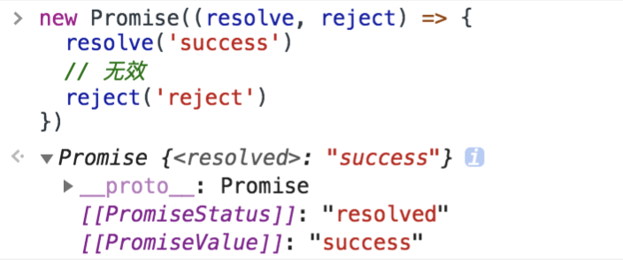
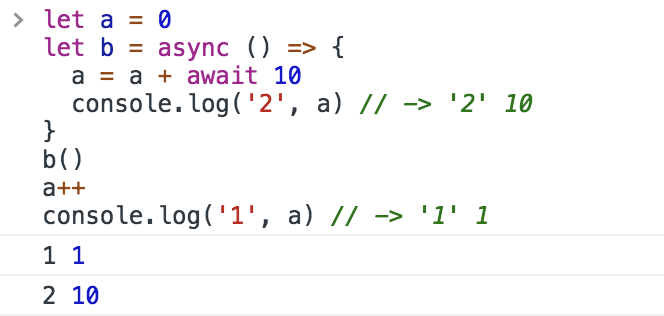
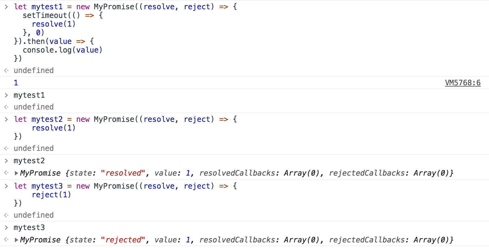

# 异步相关的知识总结

## 并发和并行的区别

**并发是宏观概念**，分别有任务 A 和任务 B，在一段时间内通过任务间的切换完成了这两个任务，这种情况就可以称之为并发。

**并行是微观概念**，假设 CPU 中存在两个核心，那么就可以同时完成任务 A、B。同时完成多个任务的情况就可以称之为并行。

## 回调地狱

```javascript
ajax(url, () => {
    // 处理逻辑
    ajax(url1, () => {
        // 处理逻辑
        ajax(url2, () => {
            // 处理逻辑
        })
    })
})
```

回调地狱的问题：

+ 嵌套函数存在耦合性，一旦有所改动，就会牵一发而动全身
+ 嵌套函数一多，就很难处理错误
+ 不能使用 try catch 捕获错误，不能直接 return。

## Generator

```javascript
function *foo(x) {
  let y = 2 * (yield (x + 1))
  let z = yield (y / 3)
  return (x + y + z)
}
let it = foo(5)
console.log(it.next())   // => {value: 6, done: false}
console.log(it.next(12)) // => {value: 8, done: false}
console.log(it.next(13)) // => {value: 42, done: true}

```

对于上述代码：

+ `Generator` 函数调用和普通函数不同，它会返回一个迭代器
+ 当执行第一次 `next` 时，传参会被忽略，并且函数暂停在 `yield (x + 1)` 处，所以返回 `5 + 1 = 6`
+ 当执行第二次 `next` 时，传入的参数等于上一个 `yield` 的返回值，如果不传参，`yield` 永远返回 `undefined`。此时 `let y = 2 * 12`，所以第二个 `yield` 等于 `2 * 12 / 3 = 8`
+ 当执行第三次 `next` 时，传入的参数会传递给 `z`，所以 `z = 13, x = 5, y = 24`，相加等于 `42`

所以可以用`Generator`函数解决回调地狱的问题

``` javascript
function *fetch() {
    yield ajax(url, () => {})
    yield ajax(url1, () => {})
    yield ajax(url2, () => {})
}
let it = fetch()
let result1 = it.next()
let result2 = it.next()
let result3 = it.next()
```

## Promise

`Promise` 翻译过来就是承诺的意思，这个承诺会在未来有一个确切的答复，并且该承诺有三种状态，分别是：

+ 等待（pending）
+ 完成 （resolved）
+ 拒绝（rejected）

`Promise`一旦从`pending`状态变成为其他状态就永远不能更改状态了，也就是说一旦状态变为 `resolved` 后，就不能再次改变



在构造 `Promise` 的时候，构造函数内部的代码是立即执行的

```javascript
new Promise((resolve, reject) => {
  console.log('new Promise')
  resolve('success')
})
console.log('finifsh')
// new Promise -> finifsh
```

`Promise` 实现了链式调用，也就是说每次调用 `then` 之后返回的都是一个 `Promise`，并且是一个全新的 `Promise`，原因也是因为状态不可变。如果在 `then` 中 使用了 `return`，那么 `return` 的值会被 `Promise.resolve()` 包装

```javascript
Promise.resolve(1)
  .then(res => {
    console.log(res) // => 1
    return 2 // 包装成 Promise.resolve(2)
  })
  .then(res => {
    console.log(res) // => 2
  })
```

所以之前回调地狱的例子可以改写为

```javascript
ajax(url)
  .then(res => {
      console.log(res)
      return ajax(url1)
  }).then(res => {
      console.log(res)
      return ajax(url2)
  }).then(res => console.log(res))
```

Promise的缺点：

+ 无法取消
+ 错误需要通过回调函数捕获


## Async Await

一个函数如果加上 `async` ，那么该函数就会返回一个 `Promise`


`async` 就是将函数返回值使用 `Promise.resolve()` 包裹了下，和 `then` 中处理返回值一样，并且 `await` 只能配套 `async` 使用

```javascript
async function test() {
  let value = await sleep()
}
```

async await的优缺点：

+ 处理then的调用链，更加清晰准确地写出代码，优雅处理回调地域问题
+ `await`将异步代码改为同步，如果多个异步代码没有依赖性且使用`await`，性能会降低

```javascript
// 异步终极解决方案
async function test() {
  // 以下代码没有依赖性的话，完全可以使用 Promise.all 的方式
  // 如果有依赖性的话，其实就是解决回调地狱的例子了
  await fetch(url)
  await fetch(url1)
  await fetch(url2)
}
```



对于上段代码输出结果的理解：

+ 首先函数`b`先执行，在执行到 `await 10` 之前变量 `a` 还是 0，因为 `await` 内部实现了 `generator` ，`generator` 会保留堆栈中东西，所以这时候 `a = 0` 被保存了下来
+ 因为 `await` 是异步操作，后来的表达式不返回 `Promise` 的话，就会包装成 `Promise.reslove(返回值)`，然后会去执行函数外的同步代码, 输出`a = 1`
+ 同步代码执行完毕后开始执行异步代码，将保存下来的值拿出来使用，这时候 `a = 0 + 10`

`await` 就是 `generator` 加上 `Promise` 的语法糖，且内部实现了自动执行 `generator`


## 常用定时器函数

`setInterval` 作用和 `setTimeout` 基本一致，只是该函数是每隔一段时间执行一次回调函数。通常来说不建议使用 `setInterval`。第一，它和 `setTimeout` 一样，不能保证在预期的时间执行任务。第二，它存在执行累积的问题：

```javascript
function demo() {
  setInterval(function(){
    console.log(2)
  },1000)
  sleep(2000)
}
demo()

```

以上代码在浏览器环境中，如果定时器执行过程中出现了耗时操作，多个回调函数会在耗时操作结束以后同时执行，这样可能就会带来性能上的问题。

如果有循环定时器的要求，可以通过 `requestAnimationFrame` 实现

```javascript
function setInterval(callback, interval) {
  const now = Date.now
  let startTime = now()
  let endTime = startTime
  let intervalTimer
  const loop = () => {
    intervalTimer = window.requestAnimationFrame(loop)
    endTime = now()
    if (endTime - startTime >= interval) {
      startTime = endTime = now()
      callback()
    }
  }
  intervalTimer = window.requestAnimationFrame(loop)
  return this.intervalTimer
}

setInterval(() => {
  console.log(1)
}, 1000)
```

首先 `requestAnimationFrame` 自带函数节流功能，可以保证只在 16 毫秒内只执行一次，并且该函数的延时效果是精确的，没有其他定时器时间不准的问题，当然也可以通过该函数来实现 `setTimeout`。

## 手写Promise

[Promise A+规范](http://www.ituring.com.cn/article/66566)

大体框架

```javascript
// 首先我们创建三个常量用于表示状态，对于经常使用的一些值都应该通过常量来管理，便于开发及后期维护
const PENDING = 'pending'
const RESOLVED = 'resolved'
const REJECTED = 'rejected'

function MyPromise(fn) {
  // 在函数体内部首先创建了常量 that，因为代码可能会异步执行，用于获取正确的 this 对象
  const that = this
  //一开始 Promise 的状态应该是 pending
  that.state = PENDING
  // value 变量用于保存 resolve 或者 reject 中传入的值
  that.value = null
  // resolvedCallbacks 和 rejectedCallbacks 用于保存 then 中的回调，
  // 因为当执行完 Promise 时状态可能还是等待中，这时候应该把 then 中的回调保存起来用于状态改变时使用
  that.resolvedCallbacks = []
  that.rejectedCallbacks = []
}
```

完善resolve和reject函数(写在MyPromise里)

```javascript

// 首先两个函数都得判断当前状态是否为等待中，因为规范规定只有等待态才可以改变状态
// 将当前状态更改为对应状态，并且将传入的值赋值给 value
// 遍历回调数组并执行
function resolve(value) {
  if (that.state === PENDING) {
    that.state = RESOLVED
    that.value = value
    that.resolvedCallbacks.map(cb => cb(that.value))
  }
}

function reject(value) {
  if (that.state === PENDING) {
    that.state = REJECTED
    that.value = value
    that.rejectedCallbacks.map(cb => cb(that.value))
  }
}
```

执行promise中传入的函数(写在MyPromise里)

```javascript
try {
  fn(resolve, reject)
} catch (e) {
  that.reject(e)
}
```

实现`then`函数

```javascript
MyPromise.prototype.then = function(onFulfilled, onRejected) {
  const that = this
  // 首先判断两个参数是否为函数类型，因为这两个参数是可选参数
  // 当参数不是函数类型时，需要创建一个函数赋值给对应的参数，同时也实现了透传
  onFulfilled = typeof onFulfilled === 'function' ? onFulfilled : v => v
  onRejected =
    typeof onRejected === 'function'
      ? onRejected
      : r => {
          throw r
        }
  // 接下来就是一系列判断状态的逻辑，
  // 当状态不是等待态时，就去执行相对应的函数。
  // 如果状态是等待态的话，就往回调函数中 push 函数
  if (that.state === PENDING) {
    that.resolvedCallbacks.push(onFulfilled)
    that.rejectedCallbacks.push(onRejected)
  }
  if (that.state === RESOLVED) {
    onFulfilled(that.value)
  }
  if (that.state === REJECTED) {
    onRejected(that.value)
  }
}
```

测试结果



以上实现的是简易版Promise, 实现完整A+规范的Promise参考 https://github.com/xieranmaya/blog/issues/3