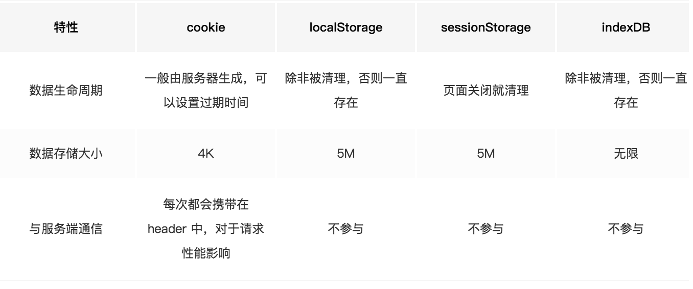
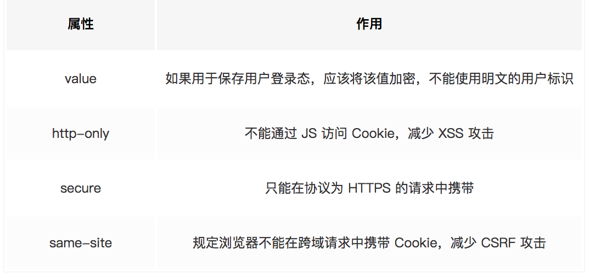
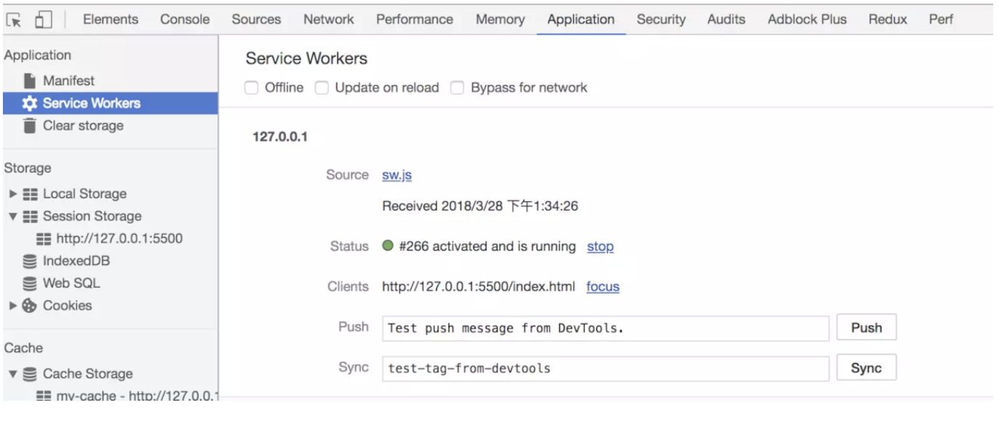
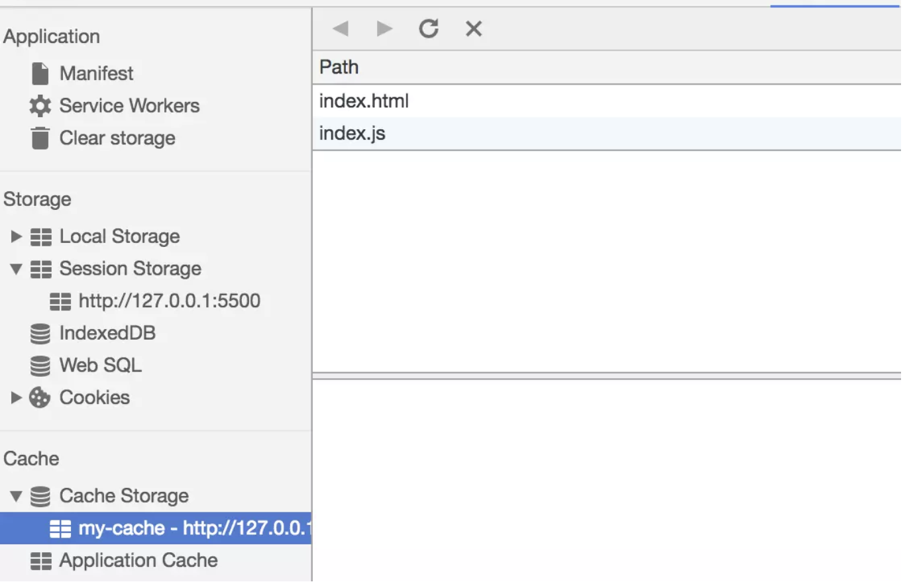
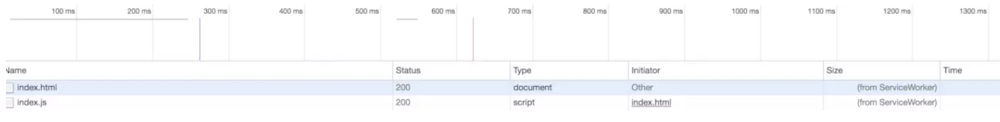
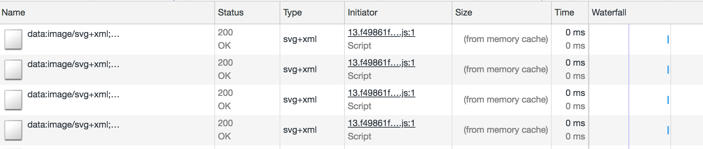
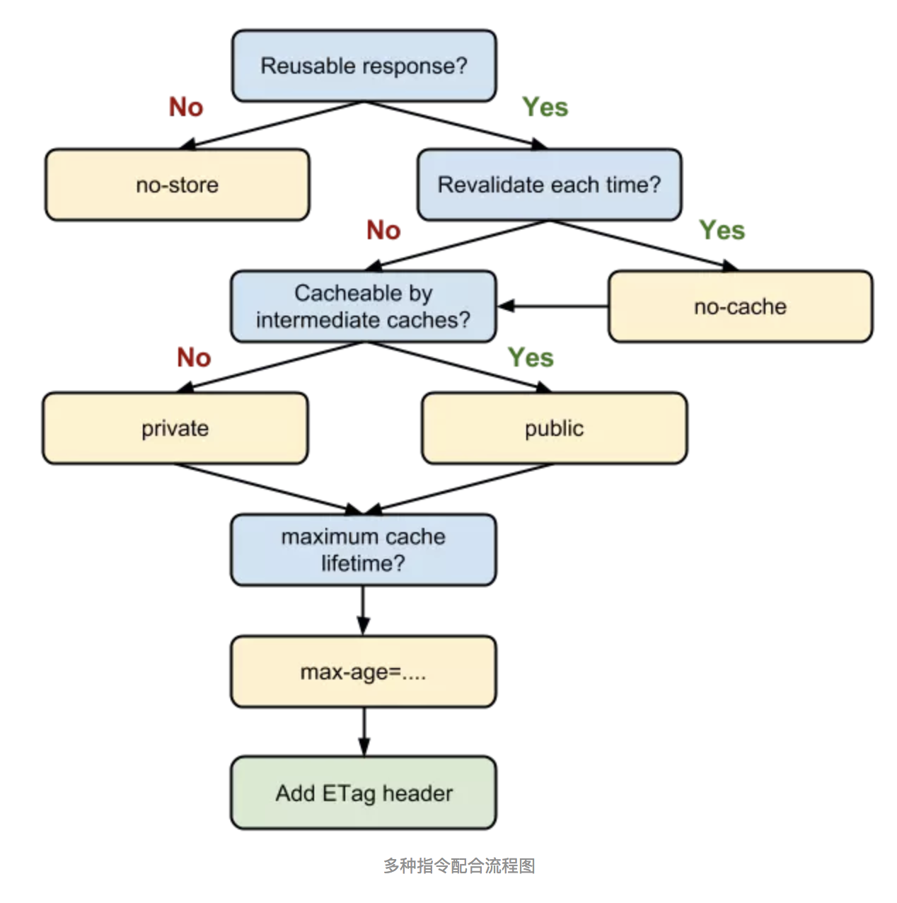
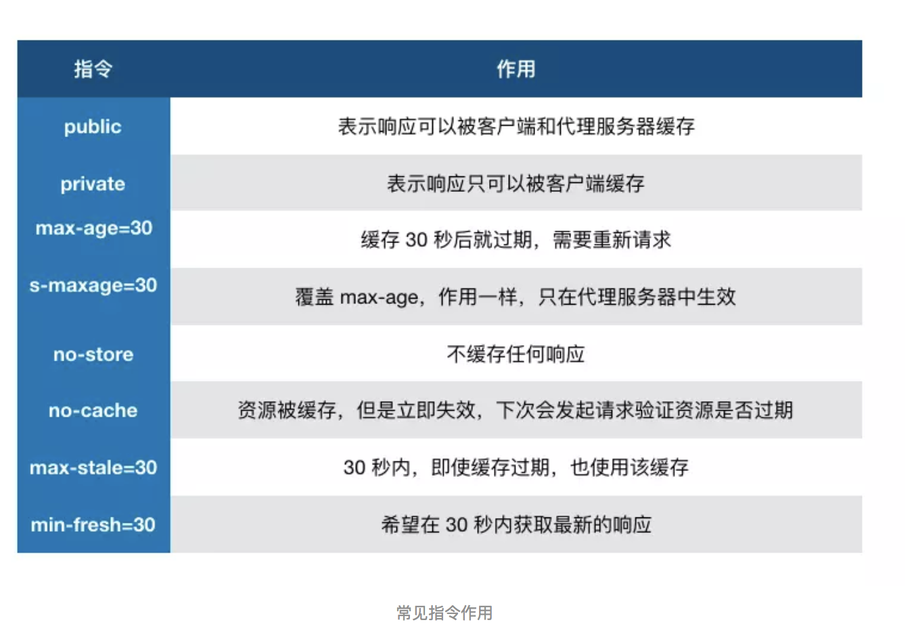
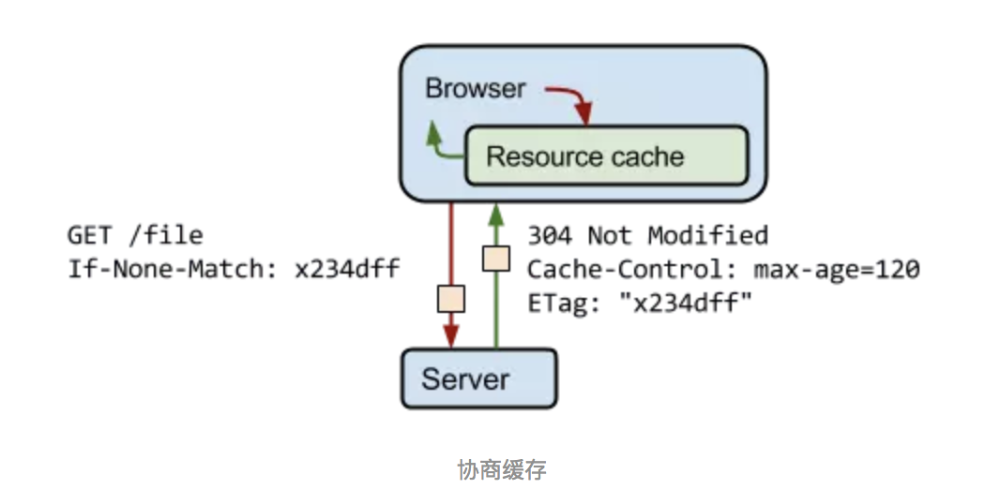
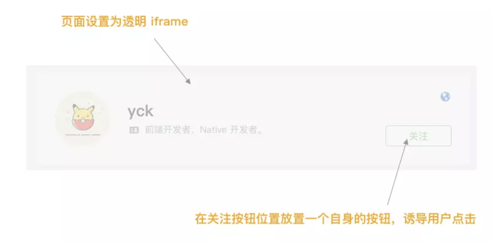

# 浏览器相关的知识

## 基础知识

### 事件机制

#### 事件触发三阶段

事件触发有三个阶段：

+ window 往事件触发处传播，遇到注册的捕获事件会触发
+ 传播到事件触发处时触发注册的事件
+ 从事件触发处往 window 传播，遇到注册的冒泡事件会触发

事件触发一般来说会按照上面的顺序进行，但是也有特例，如果给一个 body 中的子节点同时注册冒泡和捕获事件，事件触发会按照注册的顺序执行。

```javascript
// 以下会先打印冒泡然后是捕获
node.addEventListener(
  'click',
  event => {
    console.log('冒泡')
  },
  false
)
node.addEventListener(
  'click',
  event => {
    console.log('捕获 ')
  },
  true
)
```

#### 注册事件

使用 `addEventListener` 注册事件，该函数的第三个参数可以是`布尔值`，也可以是`对象`。对于布尔值 `useCapture` 参数来说，该参数默认值为 `false` ，`useCapture` 决定了注册的事件是捕获事件还是冒泡事件。对于`对象参数`来说，可以使用以下几个属性

+ `capture`：布尔值，和 `useCapture` 作用一样
+ `once`：布尔值，值为 `true` 表示该回调只会调用一次，调用后会移除监听
+ `passive`：布尔值，表示永远不会调用 `preventDefault`

如果我们只希望事件只触发在目标上，可以使用 `stopPropagation` 来阻止事件的进一步传播。通常我们认为 `stopPropagation` 是用来阻止事件冒泡的，其实该函数也可以阻止捕获事件。`stopImmediatePropagation` 同样也能实现阻止事件，但是还能阻止该事件目标执行别的注册事件。

```javascript
node.addEventListener(
  'click',
  event => {
    event.stopImmediatePropagation()
    console.log('冒泡')
  },
  false
)
// 点击 node 只会执行上面的函数，该函数不会执行
node.addEventListener(
  'click',
  event => {
    console.log('捕获 ')
  },
  true
)

```

#### 事件代理

如果一个节点中的子节点是动态生成的，那么子节点需要注册事件的话应该**注册在父节点上**，使用`event.target`找到来源

```html
<ul id="ul">
	<li>1</li>
    <li>2</li>
	<li>3</li>
	<li>4</li>
	<li>5</li>
</ul>
<script>
	let ul = document.querySelector('#ul')
	ul.addEventListener('click', (event) => {
		console.log(event.target);
	})
</script>
```

事件代理的优点：

+ 节省内存
+ 不需要给子节点注销事件

### 跨域

浏览器出于安全考虑，有同源策略。也就是说，如果`协议`、`域名`或者`端口`有一个不同就是跨域，Ajax 请求会失败。

#### JSONP

JSONP 利用 `<script>` 标签没有跨域限制的漏洞。当需要通讯时，通过 `<script>` 标签指向一个需要访问的地址并提供一个回调函数来接收数据。

```html
<script src="http://domain/api?param1=a&param2=b&callback=jsonp"></script>
<script>
    function jsonp(data) {
    	console.log(data)
	}
</script>
```

JSONP 使用简单且兼容性不错，但是**只限于 get 请求。**

在开发中可能会遇到多个 JSONP 请求的回调函数名是相同的，这时候就需要自己封装一个 JSONP，以下是简单实现

```javascript
function jsonp(url, jsonpCallback, success) {
  let script = document.createElement('script')
  script.src = url
  script.async = true
  script.type = 'text/javascript'
  window[jsonpCallback] = function(data) {
    success && success(data)
  }
  document.body.appendChild(script)
}
jsonp('http://xxx', 'callback', function(value) {
  console.log(value)
})
```

#### document.domain

该方式只能用于二级域名相同的情况下，比如 `a.test.com` 和 `b.test.com` 适用于该方式。

只需要给页面添加 `document.domain = 'test.com'` 表示二级域名都相同就可以实现跨域

#### postMessage

这种方式通常用于获取嵌入页面中的第三方页面数据。一个页面发送消息，另一个页面判断来源并接收消息

```javascript
// 发送消息端
window.parent.postMessage('message', 'http://test.com')
// 接收消息端
var mc = new MessageChannel()
mc.addEventListener('message', event => {
  var origin = event.origin || event.originalEvent.origin
  if (origin === 'http://test.com') {
    console.log('验证通过')
  }
})
```

#### CORS

CORS 需要浏览器和后端同时支持。IE 8 和 9 需要通过 XDomainRequest 来实现。

浏览器会自动进行 CORS 通信，实现 CORS 通信的关键是后端。只要后端实现了 CORS，就实现了跨域。

服务端设置 `Access-Control-Allow-Origin` 就可以开启 CORS。 该属性表示哪些域名可以访问资源，如果设置通配符则表示所有网站都可以访问资源。

虽然设置 CORS 和前端没什么关系，但是通过这种方式解决跨域问题的话，会在发送请求时出现两种情况，分别为简单请求和复杂请求。

##### 简单请求

以 Ajax 为例，当满足以下条件时，会触发简单请求

使用下列方法之一：

+ GET
+ HEAD
+ POST

Content-Type 的值仅限于下列三者之一：

+ text/plain
+ multipart/form-data
+ application/x-www-form-urlencoded

请求中的任意 `XMLHttpRequestUpload` 对象均没有注册任何事件监听器；`XMLHttpRequestUpload` 对象可以使用 `XMLHttpRequest.upload` 属性访问。

##### 复杂请求

很显然，不符合以上条件的请求就肯定是复杂请求了。

对于复杂请求来说，首先会发起一个预检请求，该请求是 `option` 方法的，通过该请求来知道服务端是否允许跨域请求。

对于预检请求来说，如果你使用过 Node 来设置 CORS 的话，可能会遇到过这么一个坑。

以下以 express 框架举例：

```javascript
app.use((req, res, next) => {
  res.header('Access-Control-Allow-Origin', '*')
  res.header('Access-Control-Allow-Methods', 'PUT, GET, POST, DELETE, OPTIONS')
  res.header(
    'Access-Control-Allow-Headers',
    'Origin, X-Requested-With, Content-Type, Accept, Authorization, Access-Control-Allow-Credentials'
  )
  next()
})
```

该请求会验证你的 `Authorization 字段`，没有的话就会报错。

当前端发起了复杂请求后，你会发现就算你代码是正确的，返回结果也永远是报错的。因为预检请求也会进入回调中，也会触发 `next` 方法，因为预检请求并不包含 `Authorization` 字段，所以服务端会报错。

想解决这个问题很简单，只需要在回调中过滤 `option` 方法即可

```javascript
res.statusCode = 204
res.setHeader('Content-Length', '0')
res.end()
```

### 存储

#### cookie，localStorage，sessionStorage，indexDB



`cookie` 已经不建议用于存储。如果没有大量数据存储需求的话，可以使用 `localStorage` 和 `sessionStorage` 。对于不怎么改变的数据尽量使用 `localStorage` 存储，否则可以用 `sessionStorage` 存储。

对于 `cookie` 来说，还需要注意安全性。



#### Service Worker

Service Worker 是运行在浏览器背后的**独立线程**，一般可以用来实现缓存功能。使用 Service Worker的话，传输协议必须为 `HTTPS`。因为 Service Worker 中涉及到请求拦截，所以必须使用 `HTTPS` 协议来保障安全。

Service Worker 实现缓存功能一般分为三个步骤：

+ 注册 Service Worker，
+ 监听到 install 事件以后就可以缓存需要的文件
+ 下次用户访问的时候就可以通过拦截请求的方式查询是否存在缓存，存在缓存的话就可以直接读取缓存文件，否则就去请求数据。

实现：

```javascript
// index.js
if (navigator.serviceWorker) {
  navigator.serviceWorker
    .register('sw.js')
    .then(function(registration) {
      console.log('service worker 注册成功')
    })
    .catch(function(err) {
      console.log('servcie worker 注册失败')
    })
}
// sw.js
// 监听 `install` 事件，回调中缓存所需文件
self.addEventListener('install', e => {
  e.waitUntil(
    caches.open('my-cache').then(function(cache) {
      return cache.addAll(['./index.html', './index.js'])
    })
  )
})

// 拦截所有请求事件
// 如果缓存中已经有请求的数据就直接用缓存，否则去请求数据
self.addEventListener('fetch', e => {
  e.respondWith(
    caches.match(e.request).then(function(response) {
      if (response) {
        return response
      }
      console.log('fetch source')
    })
  )
})

```

打开页面，可以在开发者工具中的 Application 看到 `Service Worker` 已经启动了



在 Cache 中也可以发现所需的文件已被缓存



当我们重新刷新页面可以发现我们缓存的数据是从 Service Worker 中读取的



## 浏览器缓存机制

缓存可以说是性能优化中简单高效的一种优化方式了，它可以显著减少网络传输所带来的损耗。

对于一个数据请求来说，可以分为发起`网络请求`、`后端处理`、`浏览器响应`三个步骤。**浏览器缓存可以帮助我们在第一和第三步骤中优化性能**。比如说直接使用缓存而不发起请求，或者发起了请求但后端存储的数据和前端一致，那么就没有必要再将数据回传回来，这样就减少了响应数据。

### 缓存位置

从缓存位置上来说分为四种，并且各自有优先级，

+ Service Worker
+ Memory Cache
+ Disk Cache
+ Push Cache

当依次查找缓存且都没有命中的时候，才会去请求网络

#### Service Worker缓存

`Service Worker` 的缓存与浏览器其他内建的缓存机制不同，它可以让我们自由控制缓存哪些文件、如何匹配缓存、如何读取缓存，并且缓存是持续性的。

当 `Service Worker` 没有命中缓存的时候，我们需要去调用 `fetc`h 函数获取数据。也就是说，如果我们没有在 `Service Worker` 命中缓存的话，会根据缓存查找优先级去查找数据。**但是不管我们是从 Memory Cache 中还是从网络请求中获取的数据，浏览器都会显示我们是从 Service Worker 中获取的内容。**

#### Memory Cache

Memory Cache 也就是内存中的缓存，读取内存中的数据肯定比磁盘快。但是内存缓存虽然读取高效，可是缓存持续性很短，会随着进程的释放而释放。

当我们访问过页面以后，再次刷新页面，可以发现很多数据都来自于内存缓存




那么既然内存缓存这么高效，我们是不是能让数据都存放在内存中呢？

先说结论，这是不可能的。首先计算机中的内存一定比硬盘容量小得多，操作系统需要精打细算内存的使用，所以能让我们使用的内存必然不多。内存中其实可以存储大部分的文件，比如说 JSS、HTML、CSS、图片等等。但是浏览器会把哪些文件丢进内存这个过程就很玄学， 大致观点：

+ 对于大文件来说，大概率是不存储在内存中的，反之优先
+ 当前系统内存使用率高的话，文件优先存储进硬盘

#### Disk Cache

Disk Cache 也就是存储在硬盘中的缓存，读取速度慢点，但是什么都能存储到磁盘中，比之 Memory Cache **胜在容量和存储时效性上。**

在所有浏览器缓存中，Disk Cache 覆盖面基本是最大的。它会根据 HTTP Header 中的字段判断哪些资源需要缓存，哪些资源可以不请求直接使用，哪些资源已经过期需要重新请求。**并且即使在跨站点的情况下，相同地址的资源一旦被硬盘缓存下来，就不会再次去请求数据。**

#### Push Cache

Push Cache 是 HTTP/2 中的内容，当以上三种缓存都没有命中时，它才会被使用。并且缓存时间也很短暂，只在会话（Session）中存在，一旦会话结束就被释放。

Push Cache 基本情况

+ 所有的资源都能被推送，但是 Edge 和 Safari 浏览器兼容性不怎么好
+ 可以推送 no-cache 和 no-store 的资源
+ 一旦连接被关闭，Push Cache 就被释放
+ 多个页面可以使用相同的 HTTP/2 连接，也就是说能使用同样的缓存
+ Push Cache 中的缓存只能被使用一次
+ 浏览器可以拒绝接受已经存在的资源推送
+ 你可以给其他域名推送资源

#### 网络请求

如果所有缓存都没有命中的话，那么只能发起请求来获取资源了，**为了性能上的考虑，大部分的接口都应该选择好缓存策略**

接下来讨论网络请求相关。

### 缓存策略

通常浏览器缓存策略分为两种：`强缓存`和`协商缓存`，并且**缓存策略都是通过设置 HTTP Header 来实现的**。

#### 强缓存

强缓存可以通过设置两种 HTTP Header 实现：`Expires` 和 `Cache-Control` 。强缓存表示在缓存期间不需要请求，`state code` 为 200。

##### Expires

```http
Expires: Wed, 22 Oct 2018 08:41:00 GMT
```

`Expires` 是 HTTP/1 的产物，表示资源会在 Wed, 22 Oct 2018 08:41:00 GMT 后过期，需要再次请求。并且 `Expires` 受限于本地时间，如果修改了本地时间，可能会造成缓存失效。

##### Cache-control

```http
Cache-control: max-age=30
```

`Cache-Control` 出现于 HTTP/1.1，优先级高于 Expires 。该属性值表示资源会在 30 秒后过期，需要再次请求。

`Cache-Control` 可以在请求头或者响应头中设置，并且可以组合使用多种指令

可以将多个指令配合起来一起使用（如下图），达到多个目的。比如说我们希望资源能被缓存下来，并且是客户端和代理服务器都能缓存，还能设置缓存失效时间



常见指令：



#### 协商缓存

如果缓存过期了，就需要发起请求验证资源是否有更新。协商缓存可以通过设置两种 HTTP Header 实现：`Last-Modified` 和 `ETag` 。

当浏览器发起请求验证资源时，如果资源没有做改变，那么服务端就会返回 304 状态码，并且更新浏览器缓存有效期。



##### Last-Modified 和 If-Modified-Since

`Last-Modified` 表示本地文件最后修改日期，`If-Modified-Since` 会将 `Last-Modified` 的值发送给服务器，询问服务器在该日期后资源是否有更新，有更新的话就会将新的资源发送回来，否则返回 304 状态码。

Last-Modified 存在一些弊端：

+ 如果本地打开缓存文件，即使没有对文件进行修改，但还是会造成 Last-Modified 被修改，服务端不能命中缓存导致发送相同的资源
+ 因为 `Last-Modified` 只能以秒计时，如果在不可感知的时间内修改完成文件，那么服务端会认为资源还是命中了，不会返回正确的资源

因为以上这些弊端，所以在 HTTP / 1.1 出现了 `ETag` 。

##### ETag 和 If-None-Match

`ETag` 类似于文件指纹，`If-None-Match` 会将当前 `ETag` 发送给服务器，询问该资源 `ETag` 是否变动，有变动的话就将新的资源发送回来。并且 `ETag` 优先级比 `Last-Modified` 高。

#### 如果什么缓存策略都没设置，那么浏览器会怎么处理？

对于这种情况，浏览器会采用一个启发式的算法，通常会取响应头中的 Date 减去 Last-Modified 值的 10% 作为缓存时间。

### 实际场景应用

#### 频繁变动的资源

对于频繁变动的资源，首先需要使用 `Cache-Control: no-cache` 使浏览器每次都请求服务器，然后配合 `ETag` 或者 `Last-Modified` 来验证资源是否有效。这样的做法虽然不能节省请求数量，但是能显著减少响应数据大小。

#### 代码文件

这里特指除了 HTML 外的代码文件，因为 HTML 文件一般不缓存或者缓存时间很短。

一般来说，现在都会使用工具来打包代码，那么我们就可以对文件名进行`哈希处理`，**只有当代码修改后才会生成新的文件名**。基于此，我们就可以给代码文件设置缓存有效期一年 `Cache-Control: max-age=31536000`，这样只有当 HTML 文件中引入的文件名发生了改变才会去下载最新的代码文件，否则就一直使用缓存。

## 浏览器渲染相关

### 阻塞渲染

当 script 标签加上 `defer` 属性以后，表示该 JS 文件会并行下载，但是会放到 HTML 解析完成后顺序执行，所以对于这种情况你可以把 script 标签放在任意位置。

对于没有任何依赖的 JS 文件可以加上 `async` 属性，表示 JS 文件下载和解析不会阻塞渲染。

### 重绘（Repaint）和回流（Reflow）

重绘和回流会在我们设置节点样式时频繁出现，同时也会很大程度上影响性能。

+ `重绘`是当节点需要更改外观而不会影响布局的，比如改变 color 就叫称为重绘
+ `回流`是布局或者几何属性需要改变就称为回流。

回流必定会发生重绘，重绘不一定会引发回流。**回流所需的成本比重绘高的多**，改变父节点里的子节点很可能会导致父节点的一系列回流。

以下几个动作可能会导致性能问题：

+ 改变 window 大小
+ 改变字体
+ 添加或删除样式
+ 文字改变
+ 定位或者浮动
+ 盒模型

重绘和回流其实也和 Eventloop 有关， 步骤如下。

1. 当 Eventloop 执行完 Microtasks 后，会判断 document 是否需要更新，因为浏览器是 60Hz 的刷新率，每 16.6ms 才会更新一次。
2. 判断是否有 resize 或者 scroll 事件，有的话会去触发事件，所以 resize 和 scroll 事件也是至少 16ms 才会触发一次，并且自带节流功能。
3. 判断是否触发了 media query
4. 更新动画并且发送事件
5. 判断是否有全屏操作事件
6. 执行 requestAnimationFrame 回调
7. 执行 IntersectionObserver 回调，该方法用于判断元素是否可见，可以用于懒加载上，但是兼容性不好
8. 更新界面

以上就是一帧中可能会做的事情。如果在一帧中有空闲时间，就会去执行 `requestIdleCallback` 回调。

减少重绘和回流

+ 使用 transform 替代 top

```html
<div class="test"></div>
<style>
  .test {
    position: absolute;
    top: 10px;
    width: 100px;
    height: 100px;
    background: red;
  }
</style>
<script>
  setTimeout(() => {
    // 引起回流
    document.querySelector('.test').style.top = '100px'
  }, 1000)
</script>
```

+ 使用 `visibility` 替换 `display: none` ，因为前者只会引起重绘，后者会引发回流（改变了布局）

+ 不要把节点的属性值放在一个循环里当成循环里的变量

```javascript
for(let i = 0; i < 1000; i++) {
    // 获取 offsetTop 会导致回流，因为需要去获取正确的值
    console.log(document.querySelector('.test').style.offsetTop)
}
```

+ 不要使用 `table 布局`，可能很小的一个小改动会造成整个 table 的重新布局

+ 动画实现的速度的选择，动画速度越快，回流次数越多，也可以选择使用 requestAnimationFrame

+ CSS 选择符从右往左匹配查找，避免节点层级过多

+ 将频繁重绘或者回流的节点设置为图层，**图层能够阻止该节点的渲染行为影响别的节点**。比如对于 video 标签来说，浏览器会自动将该节点变为图层。


设置节点为图层的方式:

+ `will-change`，[介绍](https://developer.mozilla.org/zh-CN/docs/Web/CSS/will-change)
+ `video`、`iframe` 标签

### 插入几万个 DOM，如果实现页面不卡顿？

解决方案：

+ 通过 requestAnimationFrame 的方式去循环的插入 DOM
+ 虚拟滚动（virtualized scroller）。

这种技术的原理就是只渲染可视区域内的内容，非可见区域的那就完全不渲染了，当用户在滚动的时候就实时去替换渲染的内容。

[React虚拟滚动组件](https://github.com/bvaughn/react-virtualized）)

## Web安全

### XSS

XSS 简单点来说，就是攻击者想尽一切办法将可以执行的代码注入到网页中。

防范

```javascript
const xss = require('xss')
let html = xss('<h1 id="title">XSS Demo</h1><script>alert("xss");</script>')
// -> <h1>XSS Demo</h1>&lt;script&gt;alert("xss");&lt;/script&gt;
console.log(html)
```

### CSP

[CSP文档](https://developer.mozilla.org/en-US/docs/Web/HTTP/Headers/Content-Security-Policy)
CSP 本质上就是建立白名单，开发者明确告诉浏览器哪些外部资源可以加载和执行。我们只需要配置规则，如何拦截是由浏览器自己实现的。我们可以通过这种方式来尽量减少 XSS 攻击。

通常可以通过两种方式来开启 CSP：

+ 设置 HTTP Header 中的 `Content-Security-Policy`
+ 设置 meta 标签的方式 `<meta http-equiv="Content-Security-Policy">`

以设置 HTTP Header 来举例

+ 只允许加载本站资源

```http
Content-Security-Policy: default-src ‘self’
```

+ 只允许加载 HTTPS 协议图片

```http
Content-Security-Policy: img-src https://*
```

+ 允许加载任何来源框架

```http
Content-Security-Policy: child-src 'none'
```

对于这种方式来说，只要开发者配置了正确的规则，那么即使网站存在漏洞，攻击者也不能执行它的攻击代码，并且 CSP 的兼容性也不错。

### CSRF

CSRF 中文名为跨站请求伪造。原理就是攻击者构造出一个后端请求地址，诱导用户点击或者通过某些途径自动发起请求。如果用户是在登录状态下的话，后端就以为是用户在操作，从而进行相应的逻辑。

举个例子，假设网站中有一个通过 GET 请求提交用户评论的接口，那么攻击者就可以在钓鱼网站中加入一个图片，图片的地址就是评论接口

```html

```

使用 POST 方式提交请求是不是就没有这个问题了呢？其实并不是，使用这种方式也不是百分百安全的，攻击者同样可以诱导用户进入某个页面，在页面中通过表单提交 POST 请求。


防范 CSRF 攻击可以遵循以下几种规则：

+ `Get` 请求不对数据进行修改
+ 不让第三方网站访问到用户 `Cookie`
+ 阻止第三方网站请求接口
+ 请求时附带验证信息，比如`验证码`或者 `Token`

#### SameSite

可以对 Cookie 设置 SameSite 属性。该属性表示 Cookie 不随着跨域请求发送，可以很大程度减少 CSRF 的攻击，但是该属性目前并不是所有浏览器都兼容。

#### 验证 Referer

对于需要防范 CSRF 的请求，我们可以通过验证 Referer 来判断该请求是否为第三方网站发起的。

#### Token

服务器下发一个随机 Token，每次发起请求时将 Token 携带上，服务器验证 Token 是否有效。

### 点击劫持

点击劫持是一种视觉欺骗的攻击手段。攻击者将需要攻击的网站通过 iframe 嵌套的方式嵌入自己的网页中，并将 iframe 设置为透明，在页面中透出一个按钮诱导用户点击。



对于这种攻击方式，推荐防御的方法有两种。

#### X-FRAME-OPTIONS

`X-FRAME-OPTIONS` 是一个 HTTP 响应头，在现代浏览器有一个很好的支持。这个 HTTP 响应头 就是为了防御用 iframe 嵌套的点击劫持攻击。

该响应头有三个值可选，分别是

+ `DENY`，表示页面不允许通过 iframe 的方式展示
+ `SAMEORIGIN`，表示页面可以在相同域名下通过 iframe 的方式展示
+ `ALLOW-FROM`，表示页面可以在指定来源的 iframe 中展示


#### JS 防御

对于某些远古浏览器来说，并不能支持上面的这种方式，只有通过 JS 的方式来防御点击劫持。

```html
<head>
  <style id="click-jack">
    html {
      display: none !important;
    }
  </style>
</head>
<body>
  <script>
    if (self == top) {
      var style = document.getElementById('click-jack')
      document.body.removeChild(style)
    } else {
      top.location = self.location
    }
  </script>
</body>
```

以上代码的作用就是**当通过 iframe 的方式加载页面时，攻击者的网页直接不显示所有内容了**。


### 中间人攻击

中间人攻击是攻击方同时与服务端和客户端建立起了连接，并让对方认为连接是安全的，但是实际上整个通信过程都被攻击者控制了。攻击者不仅能获得双方的通信信息，还能修改通信信息。

通常来说不建议使用公共的 Wi-Fi，因为很可能就会发生中间人攻击的情况。如果你在通信的过程中涉及到了某些敏感信息，就完全暴露给攻击方了。

当然防御中间人攻击其实并不难，只需要增加一个安全通道来传输信息。HTTPS 就可以用来防御中间人攻击，但是并不是说使用了 HTTPS 就可以高枕无忧了，因为如果你没有完全关闭 HTTP 访问的话，攻击方可以通过某些方式将 HTTPS 降级为 HTTP 从而实现中间人攻击。

## 路由原理

前端路由实现起来其实很简单，本质就是监听 URL 的变化，然后匹配路由规则，显示相应的页面，并且无须刷新页面。目前前端使用的路由就只有两种实现方式

+ Hash 模式
+ History 模式

### Hash 模式

`www.test.com/#/` 就是 Hash URL，当 `#` 后面的哈希值发生变化时，可以通过 `hashchange` 事件来监听到 URL 的变化，从而进行跳转页面，并且无论哈希值如何变化，服务端接收到的 URL 请求永远是 `www.test.com`。

```javascript
window.addEventListener('hashchange', () => {
  // ... 具体逻辑
})
```

Hash 模式相对来说更简单，并且兼容性也更好。

### History 模式

History 模式是 HTML5 新推出的功能，主要使用 `history.pushState` 和 `history.replaceState` 改变 URL。

通过 History 模式改变 URL 同样不会引起页面的刷新，只会更新浏览器的历史记录。

```javascript
// 新增历史记录
history.pushState(stateObject, title, URL)
// 替换当前历史记录
history.replaceState(stateObject, title, URL)
```

当用户做出浏览器动作时，比如点击后退按钮时会触发 `popState` 事件

```javascript
window.addEventListener('popstate', e => {
  // e.state 就是 pushState(stateObject) 中的 stateObject
  console.log(e.state)
})
```

### 两种模式对比

+ Hash 模式只可以更改 `#` 后面的内容，History 模式可以通过 API 设置任意的`同源 URL`
+ History 模式可以通过 API 添加任意类型的数据到历史记录中，Hash 模式只能更改哈希值，也就是字符串
+ Hash 模式无需后端配置，并且兼容性好。History 模式在用户手动输入地址或者刷新页面的时候会发起 URL 请求，后端需要配置 index.html 页面用于匹配不到静态资源的时候
