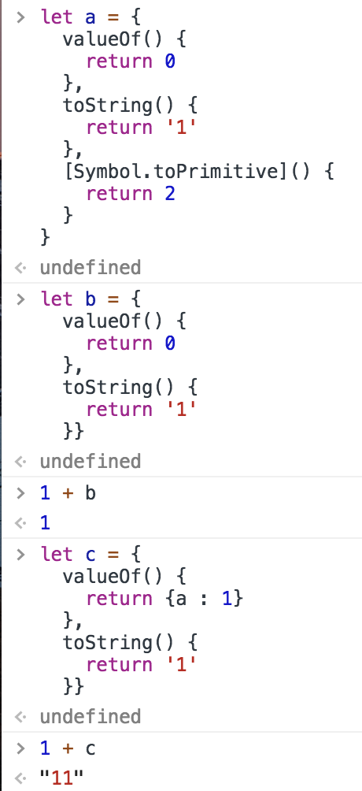
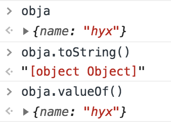
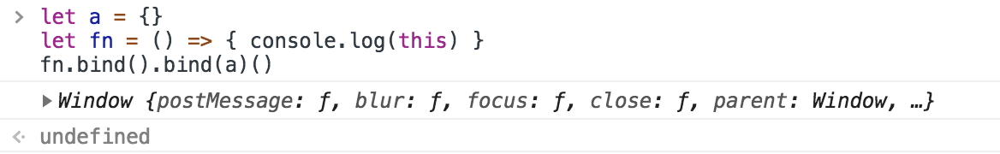
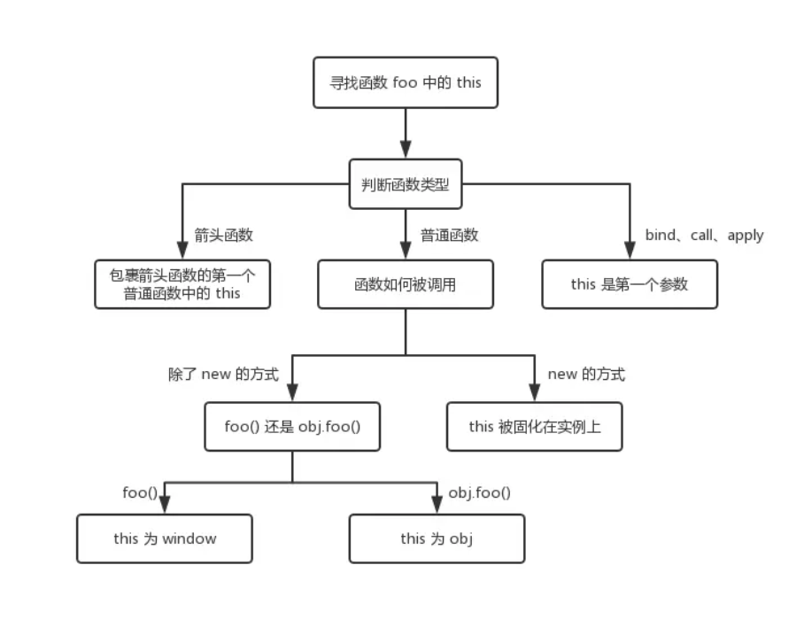
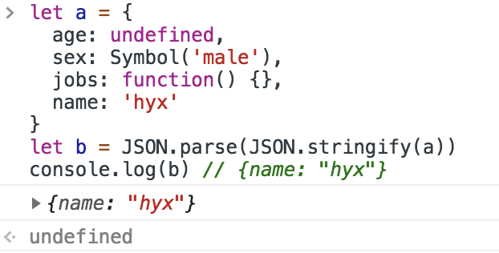
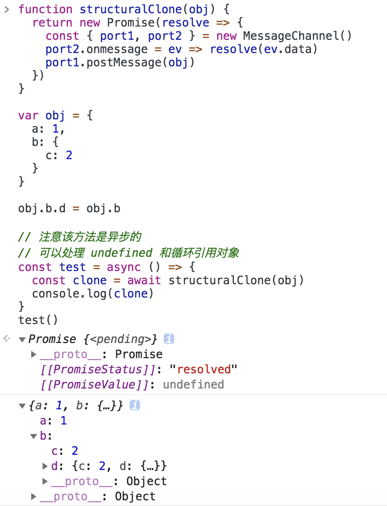
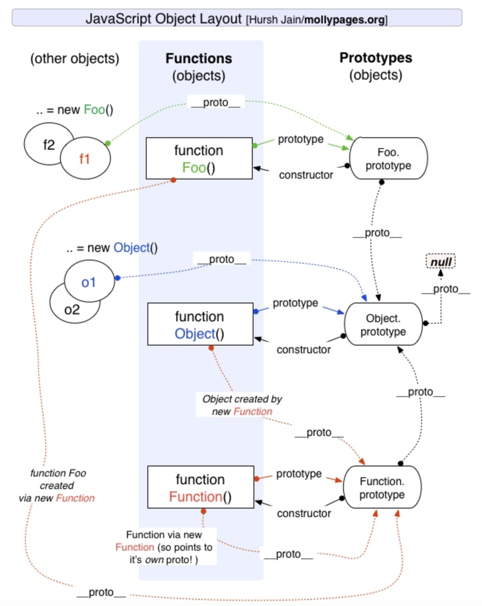

# 面试中一些Js基础知识

## 六种原始（primitive）类型：

+ `boolean`
+ `null`
+ `undefined`
+ `number`
+ `string`
+ `symbol`

string 类型是不可变的，无论在string类型上调用何种方法，都不会对值有改变。

`type of null`输出`object`的解释：在 JS 的最初版本中使用的是 32 位系统，为了性能考虑使用低位存储变量的类型信息，000 开头代表是对象，然而 null 表示为全零，所以将它错误的判断为 object 。虽然现在的内部类型判断代码已经改变了，但是对于这个 Bug 却是一直流传下来。

## 关于对象类型

```javascript
function test(person) {
  person.age = 26;
  person = {
    name: "aaa",
    age: 30
  };

  return person;
}
const p1 = {
  name: "bbb",
  age: 25
};
const p2 = test(p1);

// person有了新的地址，和p1没有关联了
console.log(p1); // -> { name: 'bbb', age: 26 }
console.log(p2); // -> { name: 'aaa', age: 30 }

const a = [];
const b = a;
b.push(1);
// a和p的值同时被改变
console.log(a); // 1
```

## typeof

```javascript
// 可以显示除了null之外的所有原始类型
typeof 1 // 'number'
typeof '1' // 'string'
typeof undefined // 'undefined'
typeof true // 'boolean'
typeof Symbol() // 'symbol'
typeof null // 'object'

// 对于对象，除了函数都显示为object
typeof [] // 'object'
typeof {} // 'object'
typeof console.log // 'function'
```

## instanceof

```javascript
// instanceof的内部机制是通过原型链来判断
var str = 'hello world'
str instanceof String // false

var str1 = new String('hello world')
str1 instanceof String // true
```


## 类型转换


### 对象转原始类型

对象在转换类型的时候，会调用内置的 [[ToPrimitive]] 函数，逻辑如下：

+ 如果已经是原始类型了，不需要转换
+ 调用`x.valueOf()`，如果转换为基础类型，就返回转换的值
+ 调用`x.toString()`，如果转换为基础类型，就返回转换的值
+ 如果都没有返回原始类型，就会报错

```javascript
let a = {
  valueOf() {
    return 0
  },
  toString() {
    return '1'
  },
  [Symbol.toPrimitive]() {
    return 2
  }
}

1 + a // => 3
```




### 四则运算符

对于加法运算符：

+ 运算中其中一方为字符串，那么就会把另一方也转换为字符串
+ 如果一方不是字符串或者数字，那么会将它转换为数字或者字符串

```javascript
1 + '1' // '11' , 将数字 1 转换为字符串
true + true // 2 , 将 true 转为数字 1
4 + [1,2,3] // "41,2,3", 数组通过 toString 转为字符串 1,2,3，得到结果 41,2,3
'a' + + 'b' // -> "aNaN",  + 'b' 等于 NaN，所以结果为 "aNaN"
```

对于除了加法的运算符来说，只要其中一方是数字，那么另一方就会被转为数字：

```javascript
4 * '3' // 12
4 * [] // 0
4 * [1, 2] // NaN
```

对于比较运算符：

+ 如果是对象，就通过`toPrimitive`转换对象
+ 如果是字符串，就通过`unicode`字符索引来比较

```javascript
let a = {
  valueOf() {
    return 0
  },
  toString() {
    return '1'
  }
}
a > -1 // true, 因为 a 是对象，所以会通过 valueOf 转换为原始类型再比较值。
```

## this

```javascript
function foo() {
  console.log(this.a)
}
let a = 1
foo()

const obj = {
  a: 2,
  foo: foo
}
obj.foo()

const c = new foo()
```

对于上面这段代码

+ 直接调用`foo`：不管`foo`函数被放在了什么地方，`this` 一定是`window`
+ `obj.foo()`：谁调用函数，谁就是`this`，所以在这个场景下`foo`函数中的`this`就是`obj`对象
+ `new`的方式来说，`this`被永远绑定在了`c`上面，不会被任何方式改变

### 箭头函数

箭头函数其实是没有`this`的，箭头函数中的`this`只取决包裹箭头函数的第一个普通函数的`this`。
箭头函数使用`bind`这类函数是无效的。


### Bind

不管给函数`bind`几次，`fn`中的`this`永远由第一次 `bind`决定



### This总结



## == vs ===

### ==的判断流程

1. 首先会判断两者类型是否相同。相同的话比大小了
2. 类型不相同的话，那么就会进行类型转换
3. 会先判断是否在对比`null`和`undefined`，是的话就会返回`true`
4. 判断两者类型是否为`string`和`number`，是的话就会将字符串转换为`number`
5. 判断其中一方是否为`boolean`，是的话就会把 `boolean`转为`number`再进行判断
6. 判断其中一方是否为`object`且另一方为 `string`、`number`或者`symbol`，是的话就会把`object` 转为原始类型再进行判断

```javascript
[] == ![] // true，判断流程如下图
```


## 闭包

闭包的定义其实很简单：函数 A 内部有一个函数 B，函数 B 可以访问到函数 A 中的变量，那么函数 B 就是闭包。

>经典面试题，循环中使用闭包解决 `var`

```javascript
for (var i = 1; i <= 5; i++) {
  setTimeout(function timer() {
    console.log(i)
  }, i * 1000)
}
```

`setTimeout`是个异步函数，所以会先把循环全部执行完毕，这时候 i 就是 6 了，所以会输出一堆 6。

解决方案1：使用闭包


解决方案2：使用`setTimeout`的第三个参数，第三个及以后的参数会被当成`timer`(setTimeout里面函数)的参数传入

```javascript
for (var i = 1; i <= 5; i++) {
  setTimeout(
    function timer(j) {
      console.log(j)
    },
    i * 1000,
    i
  )
}
```

解决方案3：将`var`改成`let`即可 -**推荐**

## 深浅拷贝

对象类型在赋值的过程中其实是复制了地址，从而会导致改变了一方其他也都被改变的情况，我们可以使用浅拷贝来解决这个情况。

### 浅拷贝

用`Object.assign`，他会拷贝所有的属性值到新的对象中，如果属性值是对象的话，拷贝的是地址

```javascript
let a = {
  age: 1
}
let b = Object.assign({}, a)
a.age = 2
console.log(b.age) // 1
```

或者通过展开运算符来实现浅拷贝

```javascript
let a = {
  age: 1
}
let b = { ...a }
a.age = 2
console.log(b.age) // 1
```

浅拷贝只解决了第一层的问题，如果接下去的值中还有对象的话，那么就又回到最开始的话题了，两者享有相同的地址。要解决这个问题，我们就得使用深拷贝了。

### 深拷贝

#### JSON.parse(JSON.stringify(object))

通常可以通过`JSON.parse(JSON.stringify(object))`来解决。

```javascript
let a = {
  age: 1,
  jobs: {
    first: 'FE'
  }
}
let b = JSON.parse(JSON.stringify(a))
a.jobs.first = 'native'
console.log(b.jobs.first) // FE
```

但是该方法也是有局限性的：

+ 会忽略 undefined
+ 会忽略 symbol

+ 不能序列化函数
+ 不能解决循环引用的对象


但是在通常情况下，复杂数据都是可以序列化的，所以这个函数可以解决大部分问题。

#### MessageChannel

如果你所需拷贝的对象含有内置类型并且不包含函数，可以使用`MessageChannel`

关于MessageChannel

```javascript
let channel = new MessageChannel(); //创建管道。

// 实例属性
let port1 = channel.port1
let port2 = channel.port2
// 使用onmessage收取数据，使用postMeaasge传递数据
port1.onmessage = function(event) {
    console.log("port1收到来自port2的数据：" + event.data);
}
port2.onmessage = function(event) {
    console.log("port2收到来自port1的数据：" + event.data);
}
port1.postMessage("发送给port2");
port2.postMessage("发送给port1");
```

MessageChannel实现深拷贝方法

```javascript
function deepClone(obj) {
  return new Promise(resolve => {
    const { port1, port2 } = new MessageChannel()
    port2.onmessage = ev => resolve(ev.data)
    port1.postMessage(obj)
  })
}

```



#### 简易深拷贝

实现一个深拷贝是很困难的，需要我们考虑好多种边界情况，比如原型链如何处理、DOM 如何处理等等，所以这里实现的深拷贝只是简易版，更推荐使用lodash的深拷贝函数

```javascript
function deepClone(obj) {
  function isObject(o) {
    return (typeof o === 'object' || typeof o === 'function') && o !== null
  }

  if (!isObject(obj)) {
    throw new Error('非对象')
  }

  let isArray = Array.isArray(obj)
  let newObj = isArray ? [...obj] : { ...obj }
  // 静态方法 Reflect.ownKeys() 返回一个由目标对象自身的属性键组成的数组。
  Reflect.ownKeys(newObj).forEach(key => {
    newObj[key] = isObject(obj[key]) ? deepClone(obj[key]) : obj[key]
  })

  return newObj
}

```

#### lodash深拷贝函数（实际项目中推荐）

```javascript
var objects = [{ 'a': 1 }, { 'b': 2 }];

var deep = _.cloneDeep(objects);
console.log(deep[0] === objects[0]);
// => false
```

## 原型

每个 JS 对象都有 `__proto__` 属性，这个属性指向了原型.可以通过 `__proto__` 找到一个原型对象，在该对象中定义了很多函数让我们来使用。原型的 `constructor` 属性指向构造函数，构造函数又通过 `prototype` 属性指回原型，但是并不是所有函数都具有这个属性，`Function.prototype.bind()` 就没有这个属性。


原型总结：




所以原型链就是多个对象通过 `__proto__` 的方式连接了起来。为什么`obj`可以访问到`valueOf`函数，就是因为`obj`通过原型链找到了`valueOf`函数。

+ Object 是所有对象的原型，所有对象都可以通过 `__proto__` 找到它
+ Function 是所有函数的原型，所有函数都可以通过`__proto__` 找到它
+ 函数的 `prototype` 是一个对象
+ 对象的 `__proto__` 属性指向原型， `__proto__` 将对象和原型连接起来组成了原型链