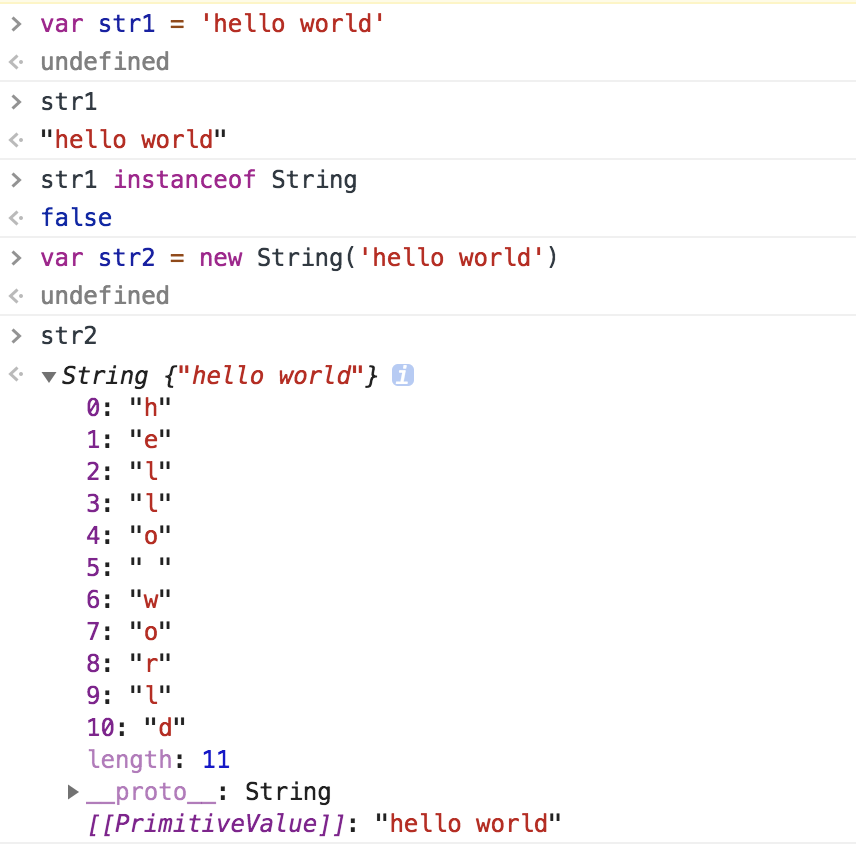
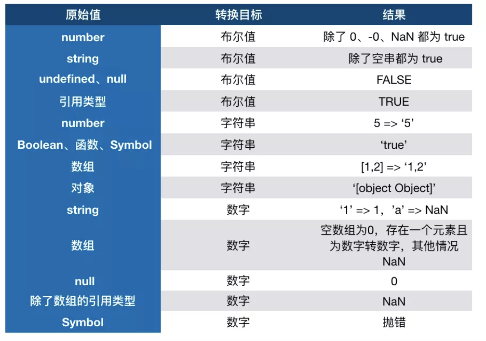
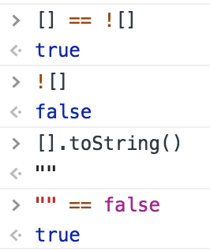
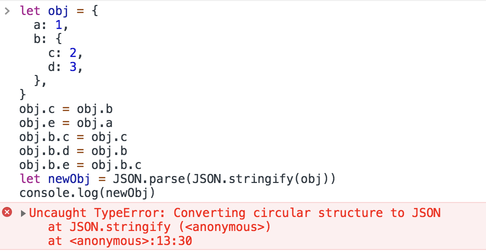
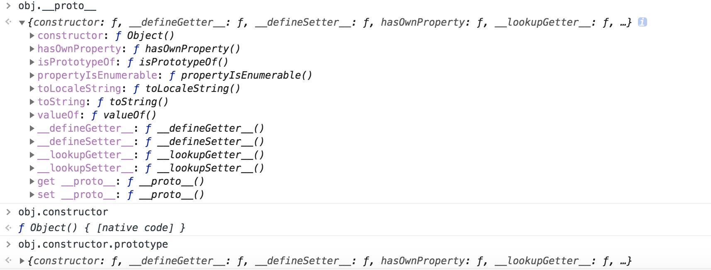
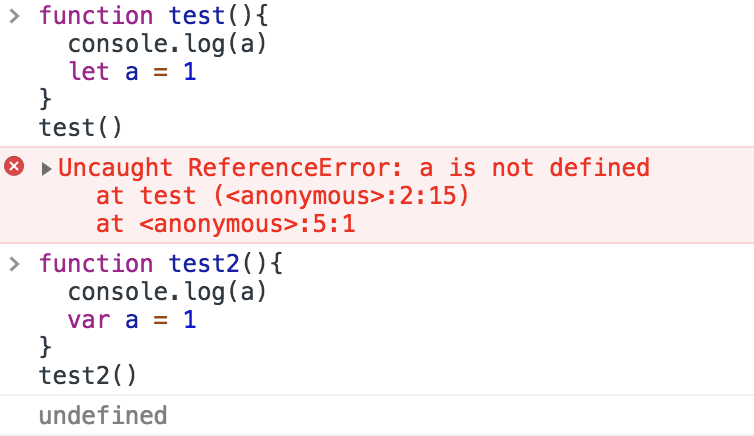
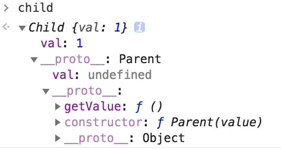
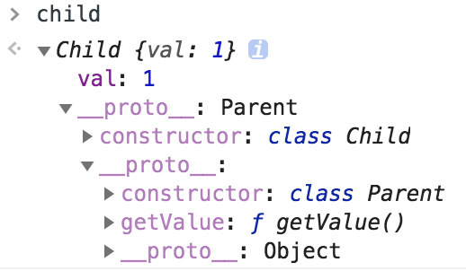
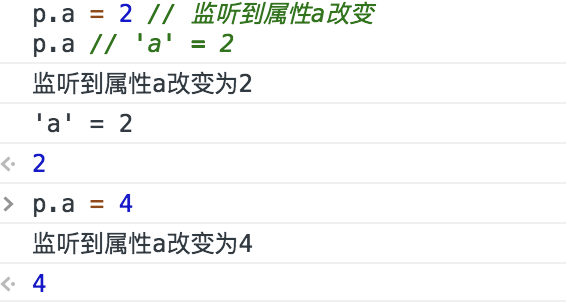

# 面试中一些Js基础知识

## 六种原始（primitive）类型：

+ `boolean`
+ `null`
+ `undefined`
+ `number`
+ `string`
+ `symbol`

string 类型是不可变的，无论在string类型上调用何种方法，都不会对值有改变。

`type of null`输出`object`的解释：在 JS 的最初版本中使用的是 32 位系统，为了性能考虑使用低位存储变量的类型信息，000 开头代表是对象，然而 null 表示为全零，所以将它错误的判断为 object 。虽然现在的内部类型判断代码已经改变了，但是对于这个 Bug 却是一直流传下来。

## 关于对象类型

```javascript
function test(person) {
  person.age = 26;
  person = {
    name: "aaa",
    age: 30
  };

  return person;
}
const p1 = {
  name: "bbb",
  age: 25
};
const p2 = test(p1);

// person有了新的地址，和p1没有关联了
console.log(p1); // -> { name: 'bbb', age: 26 }
console.log(p2); // -> { name: 'aaa', age: 30 }

const a = [];
const b = a;
b.push(1);
// a和p的值同时被改变
console.log(a); // 1
```

## typeof

```javascript
// 可以显示除了null之外的所有原始类型
typeof 1 // 'number'
typeof '1' // 'string'
typeof undefined // 'undefined'
typeof true // 'boolean'
typeof Symbol() // 'symbol'
typeof null // 'object'

// 对于对象，除了函数都显示为object
typeof [] // 'object'
typeof {} // 'object'
typeof console.log // 'function'
```

## instanceof

```javascript
// instanceof的内部机制是通过原型链来判断
var str = 'hello world'
str instanceof String // false

var str1 = new String('hello world')
str1 instanceof String // true
```



## 类型转换



### 对象转原始类型

对象在转换类型的时候，会调用内置的 [[ToPrimitive]] 函数，逻辑如下：

+ 如果已经是原始类型了，不需要转换
+ 调用`x.valueOf()`，如果转换为基础类型，就返回转换的值
+ 调用`x.toString()`，如果转换为基础类型，就返回转换的值
+ 如果都没有返回原始类型，就会报错

```javascript
let a = {
  valueOf() {
    return 0
  },
  toString() {
    return '1'
  },
  [Symbol.toPrimitive]() {
    return 2
  }
}

1 + a // => 3
```


### 四则运算符

对于加法运算符：

+ 运算中其中一方为字符串，那么就会把另一方也转换为字符串
+ 如果一方不是字符串或者数字，那么会将它转换为数字或者字符串

```javascript
1 + '1' // '11' , 将数字 1 转换为字符串
true + true // 2 , 将 true 转为数字 1
4 + [1,2,3] // "41,2,3", 数组通过 toString 转为字符串 1,2,3，得到结果 41,2,3
'a' + + 'b' // -> "aNaN",  + 'b' 等于 NaN，所以结果为 "aNaN"
```

对于除了加法的运算符来说，只要其中一方是数字，那么另一方就会被转为数字：

```javascript
4 * '3' // 12
4 * [] // 0
4 * [1, 2] // NaN
```

对于比较运算符：

+ 如果是对象，就通过`toPrimitive`转换对象
+ 如果是字符串，就通过`unicode`字符索引来比较

```javascript
let a = {
  valueOf() {
    return 0
  },
  toString() {
    return '1'
  }
}
a > -1 // true, 因为 a 是对象，所以会通过 valueOf 转换为原始类型再比较值。
```

## this

```javascript
function foo() {
  console.log(this.a)
}
let a = 1
foo()

const obj = {
  a: 2,
  foo: foo
}
obj.foo()

const c = new foo()
```

对于上面这段代码

+ 直接调用`foo`：不管`foo`函数被放在了什么地方，`this` 一定是`window`
+ `obj.foo()`：谁调用函数，谁就是`this`，所以在这个场景下`foo`函数中的`this`就是`obj`对象
+ `new`的方式来说，`this`被永远绑定在了`c`上面，不会被任何方式改变

### 箭头函数

箭头函数其实是没有`this`的，箭头函数中的`this`只取决包裹箭头函数的第一个普通函数的`this`。
箭头函数使用`bind`这类函数是无效的。


### Bind

不管给函数`bind`几次，`fn`中的`this`永远由第一次 `bind`决定


### This总结


## == vs ===

### ==的判断流程

1. 首先会判断两者类型是否相同。相同的话比大小了
2. 类型不相同的话，那么就会进行类型转换
3. 会先判断是否在对比`null`和`undefined`，是的话就会返回`true`
4. 判断两者类型是否为`string`和`number`，是的话就会将字符串转换为`number`
5. 判断其中一方是否为`boolean`，是的话就会把 `boolean`转为`number`再进行判断
6. 判断其中一方是否为`object`且另一方为 `string`、`number`或者`symbol`，是的话就会把`object` 转为原始类型再进行判断

```javascript
[] == ![] // true，判断流程如下图
```



## 闭包

闭包的定义其实很简单：函数 A 内部有一个函数 B，函数 B 可以访问到函数 A 中的变量，那么函数 B 就是闭包。

>经典面试题，循环中使用闭包解决 `var`

```javascript
for (var i = 1; i <= 5; i++) {
  setTimeout(function timer() {
    console.log(i)
  }, i * 1000)
}
```

`setTimeout`是个异步函数，所以会先把循环全部执行完毕，这时候 i 就是 6 了，所以会输出一堆 6。

解决方案1：使用闭包


解决方案2：使用`setTimeout`的第三个参数，第三个及以后的参数会被当成`timer`(setTimeout里面函数)的参数传入

```javascript
for (var i = 1; i <= 5; i++) {
  setTimeout(
    function timer(j) {
      console.log(j)
    },
    i * 1000,
    i
  )
}
```

解决方案3：将`var`改成`let`即可 -**推荐**

## 深浅拷贝

对象类型在赋值的过程中其实是复制了地址，从而会导致改变了一方其他也都被改变的情况，我们可以使用浅拷贝来解决这个情况。

### 浅拷贝

用`Object.assign`，他会拷贝所有的属性值到新的对象中，如果属性值是对象的话，拷贝的是地址

```javascript
let a = {
  age: 1
}
let b = Object.assign({}, a)
a.age = 2
console.log(b.age) // 1
```

或者通过展开运算符来实现浅拷贝

```javascript
let a = {
  age: 1
}
let b = { ...a }
a.age = 2
console.log(b.age) // 1
```

浅拷贝只解决了第一层的问题，如果接下去的值中还有对象的话，那么就又回到最开始的话题了，两者享有相同的地址。要解决这个问题，我们就得使用深拷贝了。

### 深拷贝

#### JSON.parse(JSON.stringify(object))

通常可以通过`JSON.parse(JSON.stringify(object))`来解决。

```javascript
let a = {
  age: 1,
  jobs: {
    first: 'FE'
  }
}
let b = JSON.parse(JSON.stringify(a))
a.jobs.first = 'native'
console.log(b.jobs.first) // FE
```

但是该方法也是有局限性的：

+ 会忽略 undefined
+ 会忽略 symbol

+ 不能序列化函数
+ 不能解决循环引用的对象


但是在通常情况下，复杂数据都是可以序列化的，所以这个函数可以解决大部分问题。

#### MessageChannel

如果你所需拷贝的对象含有内置类型并且不包含函数，可以使用`MessageChannel`

关于MessageChannel

```javascript
let channel = new MessageChannel(); //创建管道。

// 实例属性
let port1 = channel.port1
let port2 = channel.port2
// 使用onmessage收取数据，使用postMeaasge传递数据
port1.onmessage = function(event) {
    console.log("port1收到来自port2的数据：" + event.data);
}
port2.onmessage = function(event) {
    console.log("port2收到来自port1的数据：" + event.data);
}
port1.postMessage("发送给port2");
port2.postMessage("发送给port1");
```

MessageChannel实现深拷贝方法

```javascript
function deepClone(obj) {
  return new Promise(resolve => {
    const { port1, port2 } = new MessageChannel()
    port2.onmessage = ev => resolve(ev.data)
    port1.postMessage(obj)
  })
}

```


#### 简易深拷贝

实现一个深拷贝是很困难的，需要我们考虑好多种边界情况，比如原型链如何处理、DOM 如何处理等等，所以这里实现的深拷贝只是简易版，更推荐使用lodash的深拷贝函数

```javascript
function deepClone(obj) {
  function isObject(o) {
    return (typeof o === 'object' || typeof o === 'function') && o !== null
  }

  if (!isObject(obj)) {
    throw new Error('非对象')
  }

  let isArray = Array.isArray(obj)
  let newObj = isArray ? [...obj] : { ...obj }
  // 静态方法 Reflect.ownKeys() 返回一个由目标对象自身的属性键组成的数组。
  //https://developer.mozilla.org/zh-CN/docs/Web/JavaScript/Reference/Global_Objects/Reflect
  Reflect.ownKeys(newObj).forEach(key => {
    newObj[key] = isObject(obj[key]) ? deepClone(obj[key]) : obj[key]
  })

  return newObj
}

```

#### lodash深拷贝函数（实际项目中推荐）

```javascript
var objects = [{ 'a': 1 }, { 'b': 2 }];

var deep = _.cloneDeep(objects);
console.log(deep[0] === objects[0]);
// => false
```

## 原型

每个 JS 对象都有 `__proto__` 属性，这个属性指向了原型.可以通过 `__proto__` 找到一个原型对象，在该对象中定义了很多函数让我们来使用。原型的 `constructor` 属性指向构造函数，构造函数又通过 `prototype` 属性指回原型，但是并不是所有函数都具有这个属性，`Function.prototype.bind()` 就没有这个属性。



原型总结：


所以原型链就是多个对象通过 `__proto__` 的方式连接了起来。为什么`obj`可以访问到`valueOf`函数，就是因为`obj`通过原型链找到了`valueOf`函数。

+ Object 是所有对象的原型，所有对象都可以通过 `__proto__` 找到它
+ Function 是所有函数的原型，所有函数都可以通过`__proto__` 找到它
+ 函数的 `prototype` 是一个对象
+ 对象的 `__proto__` 属性指向原型， `__proto__` 将对象和原型连接起来组成了原型链

## var let const

### 变量提升

```javascript
console.log(a) // ƒ a() {}
var a = 1
function a() {}
```



变量和函数都会被提升，函数优先于变量提升。变量提升其实是为了解决函数间互相调用的问题。

```javascript
function test1() {
    test2()
}
function test2() {
    test1()
}
test1()
```

假如不存在提升这个情况，那么就实现不了上述的代码，因为不可能存在`test1`在`test2`前面然后`test2`又在`test1`前面。

总结：

+ 函数提升优先于变量提升，函数提升会把整个函数挪到作用域顶部，变量提升只会把声明挪到作用域顶部
+ `var`存在提升，我们能在声明之前使用。`let、const` 因为暂时性死区的原因，不能在声明前使用
+ `let`和`const`作用基本一致，但是后者声明的变量不能再次赋值

## 继承

`class`只是语法糖，本质还是函数

```javascript
class Person {}
Person instanceof Function // true
```

### 组合继承

```javascript
function Parent(value) {
  this.val = value
}
Parent.prototype.getValue = function() {
  console.log(this.val)
}
function Child(value) {
  Parent.call(this, value)
}
Child.prototype = new Parent()

const child = new Child(1)

child.getValue() // 1
child instanceof Parent // true
```

以上继承的方式核心是在子类的构造函数中通过`Parent.call(this)`继承父类的属性，然后改变子类的原型为`new Parent()`来继承父类的函数。

优点：

+ 构造函数可以传参
+ 不会与父类引用属性共享
+ 可以复用父类的函数

缺点：在继承父类函数的时候调用了父类构造函数，导致子类的原型上多了不需要的父类属性，存在内存上的浪费。



### 寄生组合继承

这种继承方式对组合继承进行了优化，组合继承缺点在于继承父类函数时调用了构造函数，我们只需要优化掉这点就行了。

```javascript
function Parent(value) {
  this.val = value
}
Parent.prototype.getValue = function() {
  console.log(this.val)
}

function Child(value) {
  Parent.call(this, value)
}
Child.prototype = Object.create(Parent.prototype, {
  constructor: {
    value: Child, // 核心
    enumerable: false, // 不可枚举（不能用for…in遍历）
    writable: true,  // 可写
    configurable: true // 可配置
  }
})

const child = new Child(1)

child.getValue() // 1
child instanceof Parent // true
```

核心：将父类的原型赋值给了子类，**并且将构造函数设置为子类**，这样既解决了无用的父类属性问题，还能正确的找到子类的构造函数。


### class继承（推荐）

```javascript
class Parent {
  constructor(value) {
    this.val = value
  }
  getValue() {
    console.log(this.val)
  }
}
class Child extends Parent {
  constructor(value) {
    super(value)
    this.val = value
  }
}
let child = new Child(1)
child.getValue() // 1
child instanceof Parent // true
```

`class`实现继承的核心在于使用`extends`表明继承自哪个父类，并且在子类构造函数中必须调用`super`，因为这段代码可以看成 `Parent.call(this, value)`。



## 模块化

使用模块化的好处：

+ 解决命名冲突
+ 提供复用性
+ 提高代码可维护性

### 立即执行函数

在早期，使用立即执行函数实现模块化是常见的手段，通过函数作用域解决了命名冲突、污染全局作用域的问题

```javascript
(function(globalVariable){
   globalVariable.test = function() {}
   // ... 声明各种变量、函数都不会污染全局作用域
})(globalVariable)
```

### AMD和CMD

```javascript
// AMD
define(['./a', './b'], function(a, b) {
  // 加载模块完毕可以使用
  a.do()
  b.do()
})
// CMD
define(function(require, exports, module) {
  // 加载模块
  var a = require('./a')
  a.doSomething()
  // 延迟加载模块
  if (need) {
    var b = require('./b')
    b.doSomething()
  }
})
```

### CommonJS

主要在node环境中使用

```javascript
// a.js
module.exports = {
    a: 1
}
// or
exports.a = 1

// b.js
var module = require('./a.js')
module.a // -> log 1

```

对require的一些理解

```javascript
var module = require('./a.js')
module.a
// 这里其实就是包装了一层立即执行函数，不会污染全局变量
// 重要的是 module 这里，module 是 Node 独有的一个变量
module.exports = {
    a: 1
}
// module 基本实现
var module = {
  id: 'xxxx', // module的唯一标识符
  exports: {} // exports 就是个空对象
}
// 这个是为什么 exports 和 module.exports 用法相似的原因
var exports = module.exports
var load = function (module) {
    // 导出的东西
    var a = 1
    module.exports = a
    return module.exports
};
// 然后当require 的时候去找到独特的id，然后将要使用的东西用立即执行函数包装

```

虽然 `exports` 和 `module.exports` 用法相似，但是不能对 exports 直接赋值。

因为 `var exports = module.exports` 这句代码表明了 `exports` 和 `module.exports` 享有相同地址，通过改变对象的属性值会对两者都起效，但是如果直接对 `exports `赋值就会导致两者不再指向同一个内存地址，修改并不会对 `module.exports` 起效。

### ES Module

原生的模块化实现方案，与CommonJS的区别如下：

+ CommonJS 支持动态导入，也就是`require(${path}/xx.js)`，后者目前不支持，但是已有提案
+ CommonJS 是同步导入，因为用于服务端，文件都在本地，同步导入即使卡住主线程影响也不大。而后者是异步导入，因为用于浏览器，需要下载文件，如果也采用同步导入会对渲染有很大影响
+ CommonJS 在导出时都是值拷贝，就算导出的值变了，导入的值也不会改变，所以如果想更新值，必须重新导入一次。但是 ES Module 采用实时绑定的方式，导入导出的值都指向同一个内存地址，所以导入值会跟随导出值变化
+ ES Module 会编译成 `require/exports` 来执行

用法：

```javascript
// 引入模块 API
import XXX from './a.js'
import { XXX } from './a.js'
// 导出模块 API
export function a() {}
export default function() {}
```

`export default`为模块指定默认输出，与`export`区别如下：


+ `export、import`可以有多个，`export default`仅有一个
+ 通过`export`方式导出，在导入时要加`{ }`，`export default`则不需要
+ `export`能直接导出变量表达式，`export default`不行。
+ `export` 导出的(属性或者方法)可以修改，但是通过`export default` 导出的不可以修改

```javascript
//model.js
let e1='export 1';
let e2='export 2';
export {e2};
export default e1;
e1='export 1 modified';
e2='export 2 modified';

//index.js
import e1, {e2}from "./model";
console.log(e1); // "export 1"
console.log(e2); // "export 2 modified"
```

## Proxy

Vue3.0 中将会通过`Proxy`来替换原本的 `Object.defineProperty`来实现数据响应式。 `Proxy` 是 ES6 中新增的功能，它可以用来自定义对象中的操作。

```javascript
let p = new Proxy(target, handler)
```

`target`代表需要添加代理的对象，`handler`用来自定义对象中的操作，比如可以用来自定义`set`或者 `get` 函数。

通过Proxy实现数据响应式

```javascript
let onWatch = (obj, setBind, getLogger) => {
  let handler = {
    get(target, property, receiver) {
      getLogger(target, property)
       // Reflext.get(), 从对象中取值
      return Reflect.get(target, property, receiver)
    },
    set(target, property, value, receiver) {
      setBind(value, property)
      // Reflext.set() 在对象上设置一个属性，返回Boolean
      return Reflect.set(target, property, value)
    }
  }
  return new Proxy(obj, handler)
}

let obj = { a: 1 }
let p = onWatch(
  obj,
  (v, property) => {
    console.log(`监听到属性${property}改变为${v}`)
  },
  (target, property) => {
    console.log(`'${property}' = ${target[property]}`)
  }
)
p.a = 2 // 监听到属性a改变
p.a // 'a' = 2

```
在上述代码中，我们通过自定义 `set` 和 `get` 函数的方式，在原本的逻辑中插入了我们的函数逻辑，实现了在对对象任何属性进行读写时发出通知。



Vue3.0 要使用 `Proxy` 替换原本的 API 原因在于 `Proxy` 无需一层层递归为每个属性添加代理，一次即可完成以上操作，性能上更好，并且原本的实现有一些数据更新不能监听到(比如数组），但是 `Proxy` 可以完美监听到任何方式的数据改变，唯一缺陷可能就是浏览器的兼容性不好了。

## map, filter, reduce

### map

`map` 作用是生成一个新数组，遍历原数组，将每个元素拿出来做一些变换然后放入到新的数组中。`map` 的回调函数接受三个参数，分别是`当前索引元素`，`索引`，`原数组`

```javascript
[1, 2, 3].map(v => v + 1) // -> [2, 3, 4]
['1','2','3'].map(parseInt) // -> [1, NaN, NaN]
```

`parseInt(string, radix)`是把`string`看为`radix`进制的数，并返回值，所以上述代码的执行过程为：

```javascript
parseInt('1', 0) -> 1
parseInt('2', 1) -> NaN
parseInt('3', 2) -> NaN
```

### filter

`filter` 的作用也是生成一个新数组，在遍历数组的时候将返回值为 `true` 的元素放入新数组，我们可以利用这个函数删除一些不需要的元素,`filter` 的回调函数也接受三个参数，用处也相同。

```javascript
let array = [1, 2, 4, 6]
let newArray = array.filter(item => item !== 6)
console.log(newArray) // [1, 2, 4]
```

### reduce

`reduce` 可以将数组中的元素通过回调函数最终转换为一个值。如果我们想实现一个功能将函数里的元素全部相加得到一个值，可能会这样写

```javascript
const arr = [1, 2, 3]
let total = 0
for (let i = 0; i < arr.length; i++) {
  total += arr[i]
}
console.log(total) // 6
```

使用 `reduce` 的话就可以将遍历部分的代码优化为一行代码

```javascript
const arr = [1, 2, 3]
const sum = arr.reduce((acc, current) => acc + current, 0)
console.log(sum)
```

对于 `reduce` 来说，它接受两个参数，分别是回调函数和初始值，接下来分解上述代码中 `reduce` 的过程

+ 首先初始值为 0，该值会在执行第一次回调函数时作为第一个参数传入
+ 回调函数接受四个参数，分别为累计值、当前元素、当前索引、原数组
+ 在一次执行回调函数时，当前值和初始值相加得出结果 1，该结果会在第二次执行回调函数时当做第一个参数传入
+ 在第二次执行回调函数时，相加的值就分别是 1 和 2，以此类推，循环结束后得到结果 6

通过 `reduce` 来实现 `map` 函数

```javascript
const arr = [1, 2, 3]
const mapArray = arr.map(value => value * 2)
const reduceArray = arr.reduce((acc, current) => {
  acc.push(current * 2)
  return acc
}, [])
console.log(mapArray, reduceArray) // [2, 4, 6]
```