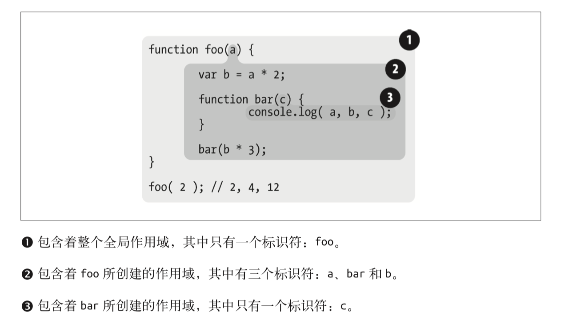

# 你不知道的JavaScript(上卷)

## 第1章 作用域是什么

### 1.1 代码

当变量出现在赋值操作的左侧时进行`LHS查询`，出现在右侧时进行`RHS查询`。
讲得更准确一点，RHS查询与简单地查找某个变量的值别无二致，而 LHS 查询则是试图找到变量的容器本身，从而可以对其赋值。从这个角度说，RHS并不是真正意义上的“赋值操作的右侧”，更准确地说是“非左侧”。**可以将RHS理解成retrieve his source value（取到它的源值）**

```javascript
console.log(a) // RHS引用
a = 2    // LHS引用
```

引擎和作用域的对话：


严格模式禁止自动或隐式地创建全局变量，在严格模式LHS查询失败与RHS查询失败均抛出`ReferenceError`异常

### 1.2 表达式

基本上可以说 JavaScript是解释型的，因为每次执行JavaScript源码时都需要进行处理。但这么说并不完全精确。JavaScript引擎实际上是动态编译程序，然后立即执行编译后的代码。

### 1.3 实践

如果要在终端中一次输入多行， 那么可以使用 `<shift> + <enter> `组合键来另起一行。一旦点击 `<enter>`键，终端会立即执行已输入的所有代码。

使用`prompt`函数获取输入

```javascipt
age = prompt( "Please tell me your age:" );
```

### 1.4 运算符

在使用变量前总是应该先声明变量。一个变量在每个作用域中只需声明一次，声明之后可以按照需要多次使用。

### 1.5 值与类型

显示类型转换: `Number("42") => 42`

隐式类型转换: `"99.99" == 99.99` 成立

### 1.6 代码注释

多行注释可以出现在行中间

```javascipt
var a = /* 任意值 */ 42;
```

## 第2章 词法作用域

### 2.1 词法阶段

作用域嵌套示例：



**作用域查找会在找到第一个匹配的标识符时停止。**
遮蔽效应：在多层的嵌套作用域中可以定义同名的标识符

全局变量会自动成为全局对象的属性，比如window, 通过全局属性可以访问被遮蔽的全局变量，但是无法访问被遮蔽的非全局变量。**词法作用域只由被声明时所处的位置决定。与在哪里被调用以及如何被调用无关**

### 2.2 欺骗词法

欺骗词法作用域会导致性能下降。

#### eval(...)

```javascript
function foo(str, a) {
  eval( str ); // 实现欺骗！
  console.log( a, b );
}
var b = 2;
foo( "var b = 3;", 1 ); // 1, 3
```

上面这段代码实际上在 foo(..) 内部创建了一个变量b ，并遮蔽了外部（全局）作用域中的同名变量。

在严格模式的程序中， `eval(..)` 在运行时有其自己的词法作用域，其中的声明无法修改所在的作用域。

#### with

`with`通常被当作重复引用同一个对象中的多个属性的快捷方式，可以不需要重复引用对象本身。（现在不推荐使用）

##### e.g

```javascript
function foo(obj) {
  with (obj) {
    a = 2;
  }
}
var o1 = { a: 3 };
var o2 = { b: 3 };
foo( o1 );
console.log( o1.a ); // 2
foo( o2 );
console.log( o2.a ); // undefined
console.log( a ); // 2 ———a被泄漏到全局作用域上！
```

由此可见，尽管`with`块可以将一个对象处理为词法作用域，但是这个块内部正常的 `var` 声明并不会被限制在这个块的作用域中，而是被添加到`with`所处的函数作用域中。

>不推荐使用 eval(..) 和 with 的原因是会被严格模式所影响（限制）。 with被完全禁止，而在保留核心功能的前提下，间接或非安全地使用eval(..)也被禁止了。

#### 性能

JavaScript引擎会在编译阶段进行数项的性能优化。其中有些优化依赖于能够根据代码的 词法进行静态分析，并预先确定所有变量和函数的定义位置，才能在执行过程中快速找到标识符。

所以当使用`eval(..)或with`时，无法在词法分析阶段明确知道`eval(..)`会接受什么代码，代码如何对作用域进行修改，也无法知道`with`创建新词法作用域的对象内容到底是什么。

总得来说，会影响引擎的优化，所以最好不要使用欺骗词法。

## 第3章 函数作用域和块作用域