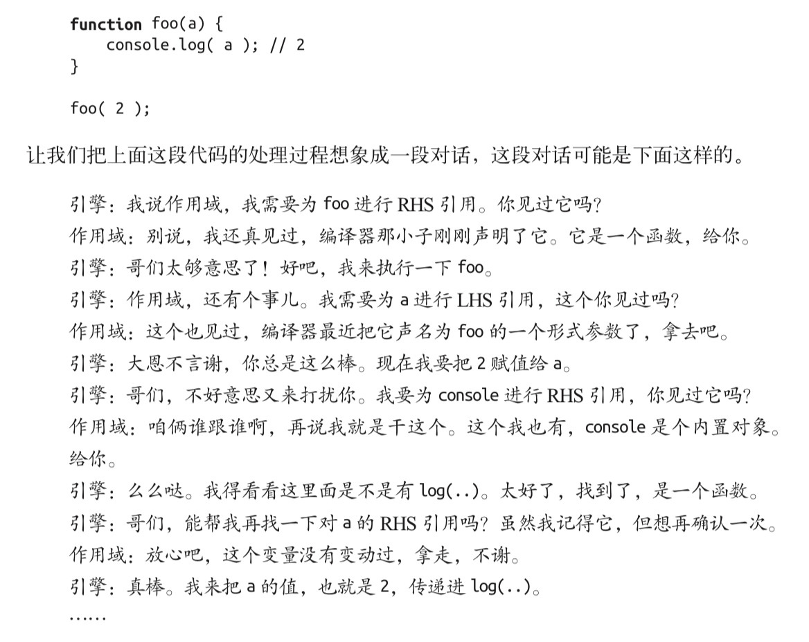

# 你不知道的JavaScript(上卷)

## 第一章

当变量出现在赋值操作的左侧时进行`LHS查询`，出现在右侧时进行`RHS查询`。
讲得更准确一点，RHS查询与简单地查找某个变量的值别无二致，而 LHS 查询则是试图找到变量的容器本身，从而可以对其赋值。从这个角度说，RHS并不是真正意义上的“赋值操作的右侧”，更准确地说是“非左侧”。**可以将RHS理解成retrieve his source value（取到它的源值）**

```javascript
console.log(a) // RHS引用
a = 2    // LHS引用
```

引擎和作用域的对话：


严格模式禁止自动或隐式地创建全局变量，在严格模式LHS查询失败与RHS查询失败均抛出`ReferenceError`异常
