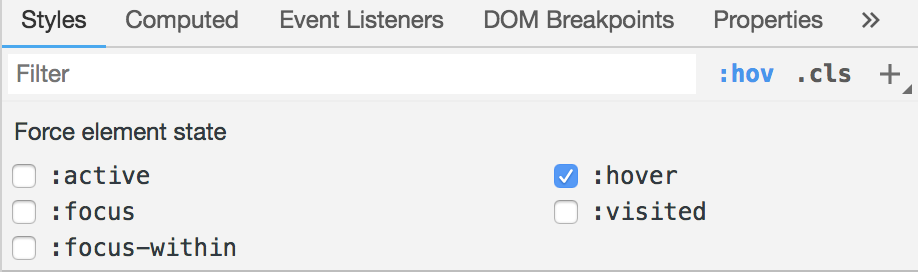
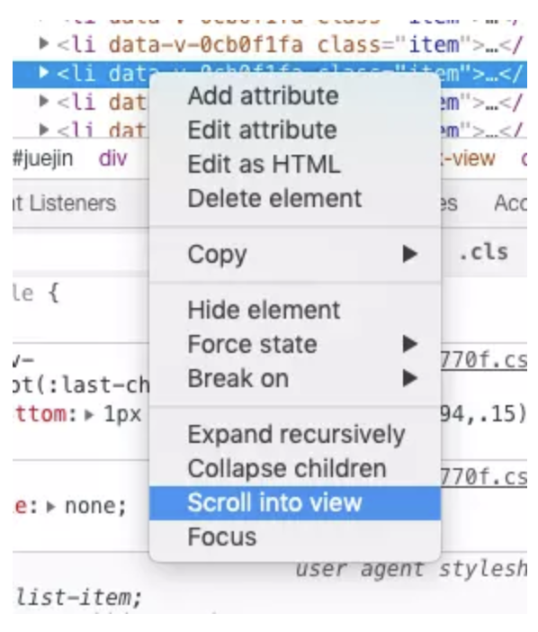
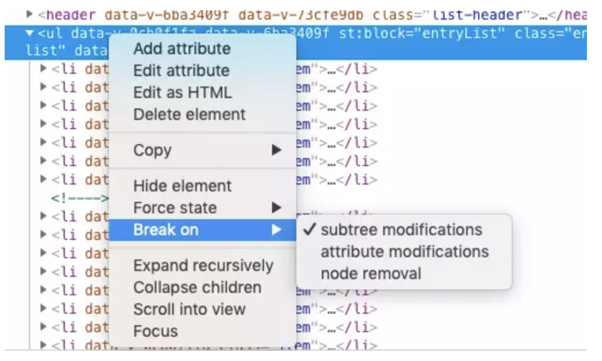
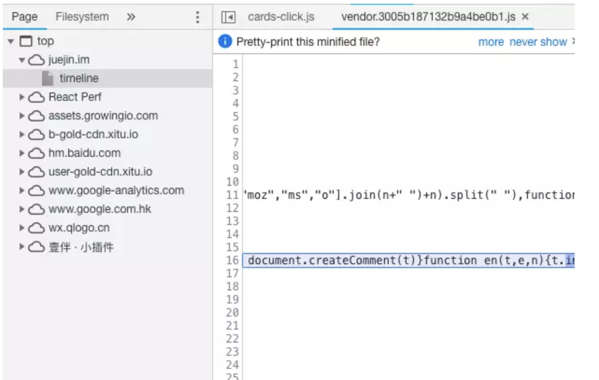
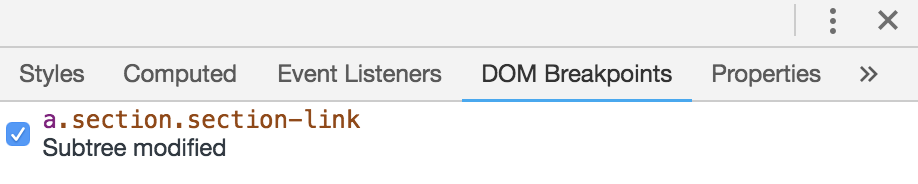
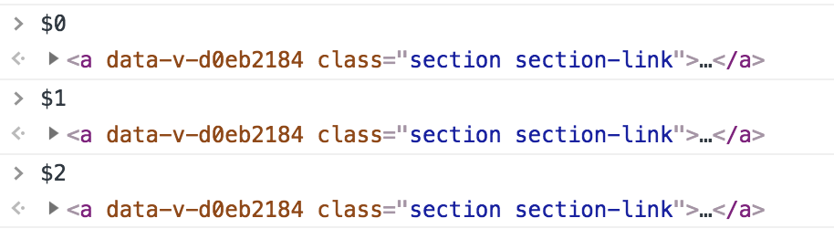
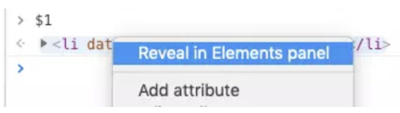

# Chrome开发者工具使用技巧

## element状态

勾选相应的状态查看样式

## 快速定位element

使用`Scoll into view`

## DOM断点

当我们给 `ul` 添加该断点以后，一旦 `ul` 子元素发生了改动，比如说增加了子元素的个数，那么就会自动跳转到对应的 `JS` 代码

在面板上查看

## 找到之前查看过的DOM元素

`$01` :上一次查看过的 DOM 元素,`$1 `就是上上次的元素，之后以此类推。

打印出来以后右键选择 `Reveal in Elements panel` 即可查看

